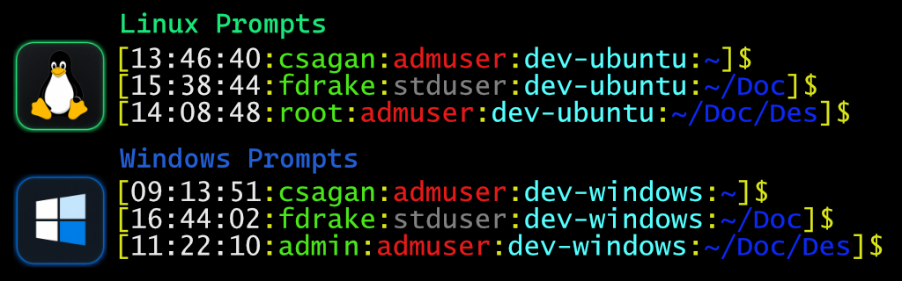

# Fancy Shells
Install a custom prompt and shell config for Bash or PowerShell.


*Example of the custom prompt on Linux and Windows.*

## Features

### Custom prompt
Both shells use the same layout and color scheme:

```
[time:user:privilege:hostname:dir]$
```

| Segment | Color | Example |
|---------|-------|---------|
| Brackets, colons, `$` | Yellow | `[` `:` `]` `$` |
| Time | Default | `02:45:53` |
| Username | Green | `csagan` |
| Privilege | Red or dim gray | `admuser` / `stduser` |
| Hostname | Cyan | `ubuntu` |
| Directory | Blue | `~/One/Doc` |

- **Privilege** — `admuser` (red) when running as root or a member of the sudo/admin group; `stduser` (dim gray) otherwise. On Windows, membership in the Administrators group counts as `admuser`.
- **Directory** — paths under home display with a Linux-style tilde (`~`, `~/Documents`). Each folder name is shortened to its first three characters (`~/OneDrive/Documents` → `~/One/Doc`).
- **Suffix** — all prompts end with `$` (privilege is shown in the `admuser`/`stduser` segment, not with `#`).
- **Window title** (PowerShell) — shows the full path even when the prompt directory is shortened.

### Shell defaults
- **History** — large command history with duplicate suppression (Bash: 50,000 entries; PowerShell: 32,767).
- **Directory helpers** — `ll`, `la`, and `l` aliases/functions (Bash: `ls` variants; PowerShell: `Get-ChildItem` variants).
- **User aliases** — optional `~/.bash_aliases` or `~/.powershell_aliases.ps1` loaded automatically if present.
- **Bash extras** — colored `ls`/`grep`, bash-completion, and cross-session history sync.

### Install safety
- Backs up your existing config to `~/.bashrc.original` or `$PROFILE.original` before replacing it.
- PowerShell installer reloads the profile automatically after install.

## Bash

```bash
bash <(curl -kfsSL https://raw.githubusercontent.com/mdkeenan/fancy-shells/main/install-fancy-shells.sh)
```

Then run `exec bash` or `source ~/.bashrc` if the prompt does not update immediately.

Installs the repo’s `bashrc` as your new `~/.bashrc`.

## PowerShell

```powershell
irm https://raw.githubusercontent.com/mdkeenan/fancy-shells/main/install-fancy-shells.ps1 | iex
```

Works with Windows PowerShell 5.1 and PowerShell 7+ (`pwsh`). Installs the repo’s `profile.ps1` as your PowerShell profile (`$PROFILE`).

## Examples

```text
[02:45:53:csagan:admuser:ASUS-LT:~/One/Doc]$
[02:35:csagan:admuser:ubuntu:~/tes]$
[22:07:fdrake:stduser:ubuntu:~]$
```
