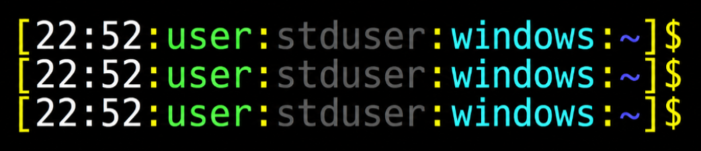

# cli-prompt-bootstrap
Install a custom prompt and shell config for Bash or PowerShell.

## Bash

```bash
bash <(curl -kfsSL https://raw.githubusercontent.com/mdkeenan/cli-prompt-bootstrap/main/install-prompt-bootstrap.sh)
```

This backs up your existing `~/.bashrc` to `~/.bashrc.original` and installs the repo’s `bashrc` as your new `~/.bashrc`.

## PowerShell

```powershell
irm https://raw.githubusercontent.com/mdkeenan/cli-prompt-bootstrap/main/install-prompt-bootstrap.ps1 | iex
```

This backs up your existing profile to `$PROFILE.original` and installs the repo’s `profile.ps1` as your PowerShell profile (`$PROFILE`).

Works with Windows PowerShell 5.1 and PowerShell 7+ (`pwsh`).

## Prompt format

Both shells use the same layout:

```
[time:user:privilege:hostname:dir]$ 
```

Privilege is `admuser` (red) when running as root or a member of the sudo/admin group, or `stduser` (dim gray) otherwise. All prompts end with `$`.


*Example of the custom Bash prompt on Linux.*

*Example of the custom Bash prompt on windows.*