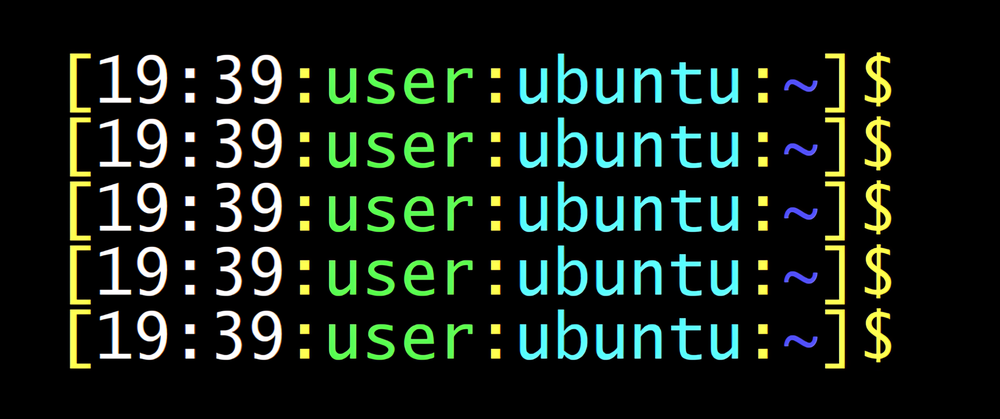

# cli-prompt-bootstrap
Install a custom Bash prompt, shell config.

## Usage

```bash
bash <(curl -kfsSL https://raw.githubusercontent.com/mdkeenan/cli-prompt-bootstrap/main/install-prompt-bootstrap.sh)
```

This backs up your existing `~/.bashrc` to `~/.bashrc.original` and installs the repo’s `bashrc` as your new `~/.bashrc`.


*Example of the custom Bash prompt on Linux.*
